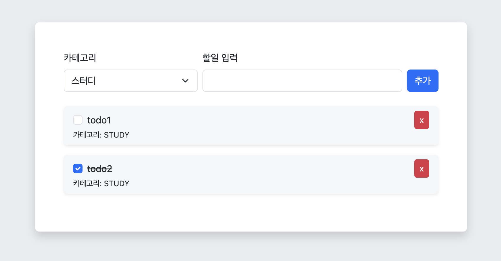

# Simple Todo List With Spring Boot 3

이 프로젝트는 스프링 부트와 타임리프를 사용하여 간단한 할일 관리 애플리케이션을 만드는 예제입니다.



## 기술 스택

- **Spring Boot**: 서버 사이드 애플리케이션을 위한 프레임워크
- **Thymeleaf**: 서버 사이드 템플릿 엔진
- **Bootstrap**: UI 디자인을 위한 프론트엔드 프레임워크

## 기능

- **할일 추가**: 사용자가 새로운 할일을 추가할 수 있습니다. (메모리에 저장)
- **할일 삭제**: 기존의 할일을 삭제할 수 있습니다.
- **카테고리 설정**: 할 일의 카테고리를 선택할 수 있으며 리스트에 카테고리가 같이 표시됩니다.

## 시작하기

### 사전 준비

- **JDK 17**: Java Development Kit 17 이상이 설치되어 있어야 합니다.
- **Gradle**: Gradle이 설치되어 있어야 합니다.

### 클론 및 빌드

이 저장소를 클론한 후, 필요한 종속성을 다운로드하고 애플리케이션을 실행할 수 있습니다.

```bash
git clone https://github.com/yourusername/todolist-app.git
cd todolist-app

./gradlew clean build
```

### 애플리케이션 실행
```bash
./gradlew bootRun
```

애플리케이션이 실행되면 http://localhost:8080에서 투두 리스트 애플리케이션에 접근할 수 있습니다.

## 라이센스
이 프로젝트는 MIT 라이센스를 따릅니다. 자세한 내용은 [LICENSE](LICENSE) 파일을 참고해 주세요.